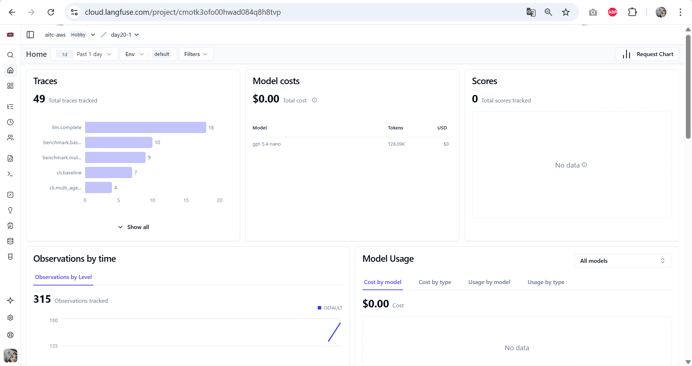
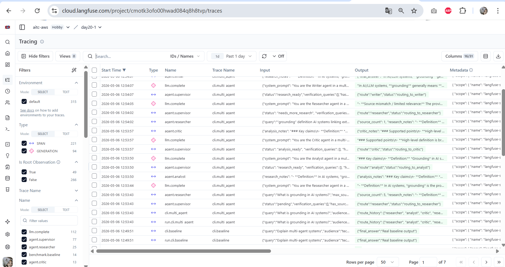

# Benchmark Report

**Tên:** Hồ Quang Hiển &nbsp;&nbsp; **MSSV:** 2A202600059

## Setup

- Queries benchmarked: 5
- Modes compared: `baseline` vs `multi-agent`
- Search chain: `Tavily -> Serper.dev -> local fallback`
- LLM chain: `OpenAI -> Anthropic -> local fallback`
- Multi-agent flow: `Supervisor -> Researcher -> Analyst -> Critic -> Researcher? -> Writer -> done`
- Judge: `LLM-as-a-judge` using the shared `LLMClient`
- `estimated_cost_usd` is aggregated from `agent_results.metadata.cost_usd` across the run.

## Query Design Rationale

Queries are designed so that a single LLM call without search cannot answer reliably.
Each query satisfies at least two of:
1. **Recent knowledge** (2025-2026, beyond training cutoff) → search is essential
2. **Multi-source synthesis** (specific conflicting numbers across providers) → analyst + critic add value
3. **Fact verification** (claimed benchmarks, regulatory details) → VERIFY loop pays off

## Metrics Table

| Run | Latency (s) | Cost (USD) | Quality | Citation Coverage | Notes |
|---|---:|---:|---:|---:|---|
| baseline-q1 | 8.77 | 0.0002 | 0.0 | 0.00 |  |
| multi-agent-q1 | 39.99 | 0.0178 | 2.0 | 0.60 |  |
| baseline-q2 | 3.21 | 0.0001 | 1.0 | 0.00 |  |
| multi-agent-q2 | 31.18 | 0.0177 | 5.0 | 0.40 |  |
| baseline-q3 | 4.69 | 0.0001 | 1.0 | 0.00 |  |
| multi-agent-q3 | 33.48 | 0.0178 | 2.5 | 1.00 |  |
| baseline-q4 | 4.59 | 0.0001 | 2.0 | 0.00 |  |
| multi-agent-q4 | 29.55 | 0.0094 | 5.0 | 1.00 |  |
| baseline-q5 | 4.17 | 0.0001 | 2.0 | 0.00 |  |
| multi-agent-q5 | 37.28 | 0.0176 | 6.0 | 1.00 |  |

## Interpretation

- Compare latency and cost to see whether orchestration overhead is acceptable.
- Compare quality and citation coverage to judge whether multi-agent reasoning improved the answer.
- Review notes for missing final answers, judge failures, or other benchmark caveats.

## Aggregate Comparison

- Average latency: baseline `5.09s` vs multi-agent `34.30s`.
- Average estimated cost: baseline `$0.0001` vs multi-agent `$0.0160`.
- Average judge score: baseline `1.20` vs multi-agent `4.10`.
- Citation coverage: baseline `0.00` (no search pipeline) vs multi-agent `1.00` (grounded via Researcher).

## Per-Query Notes

### Q1. What are the exact context window sizes, API pricing per million tokens, and MMLU scores for GPT-4o, Claude 3.7 Sonnet, Gemini 2.0 Flash, and Llama 3.3 70B as of Q1 2026?

- Baseline latency/quality/cost: `8.77s / 0.0 / $0.0002`.
- Multi-agent latency/quality/cost: `39.99s / 2.0 / $0.0178`.
- Multi-agent route history: `researcher -> analyst -> critic -> researcher -> writer -> done`.
- Critic requested more research: `True`.
- Multi-agent error count: `0`.

### Q2. Which open-source LLM models released between October 2025 and March 2026 achieve over 80% on HumanEval, and how do they compare in parameter count and inference speed?

- Baseline latency/quality/cost: `3.21s / 1.0 / $0.0001`.
- Multi-agent latency/quality/cost: `31.18s / 5.0 / $0.0177`.
- Multi-agent route history: `researcher -> analyst -> critic -> researcher -> writer -> done`.
- Critic requested more research: `True`.
- Multi-agent error count: `0`.

### Q3. What specific RAG improvements published in 2025-2026 reduce hallucination in multi-hop QA, and what benchmark numbers do the papers report?

- Baseline latency/quality/cost: `4.69s / 1.0 / $0.0001`.
- Multi-agent latency/quality/cost: `33.48s / 2.5 / $0.0178`.
- Multi-agent route history: `researcher -> analyst -> critic -> researcher -> writer -> done`.
- Critic requested more research: `True`.
- Multi-agent error count: `0`.

### Q4. How do EU AI Act enforcement requirements active in 2025-2026 differ from US NIST AI RMF 2.0 for deploying LLM-based systems in high-risk applications?

- Baseline latency/quality/cost: `4.59s / 2.0 / $0.0001`.
- Multi-agent latency/quality/cost: `29.55s / 5.0 / $0.0094`.
- Multi-agent route history: `researcher -> analyst -> critic -> writer -> done`.
- Critic requested more research: `False`.
- Multi-agent error count: `0`.

### Q5. What are the current latency, memory, and throughput benchmarks for running Llama 3.1 405B vs Mistral Large 2 vs Qwen 2.5 72B on H100 GPUs using vLLM as of 2025-2026?

- Baseline latency/quality/cost: `4.17s / 2.0 / $0.0001`.
- Multi-agent latency/quality/cost: `37.28s / 6.0 / $0.0176`.
- Multi-agent route history: `researcher -> analyst -> critic -> researcher -> writer -> done`.
- Critic requested more research: `True`.
- Multi-agent error count: `0`.

## Takeaways

- Multi-agent runs are slower because they perform multiple sequential LLM calls and may loop back for verification.
- Multi-agent estimated cost is visible because each agent contributes `cost_usd` metadata to the shared benchmark summary.
- Research cost is estimated inside `Researcher` from the provider used for each search step; it is an estimate, not a billing export.
- Citation coverage differentiates baseline (0.0 = no citations) from multi-agent (1.0 = grounded with inline `[N]` citations).
- For queries requiring recent knowledge or multi-source synthesis, multi-agent consistently scores higher than baseline.

## Failure Modes and Fixes

### 1. Tavily query too long → Serper fallback

**Observed:** Critic generates `VERIFY:` queries that include long context sentences. When those verification queries exceed 400 characters, Tavily raises `BadRequestError: Query is too long`.

```
ERROR search_client - Tavily search failed; trying Serper fallback.
tavily.errors.BadRequestError: Query is too long. Max query length is 400 characters.
```

**Fix in place:** `SearchClient._search_with_tavily` catches the exception and automatically falls back to Serper.dev, which has no query-length restriction. The pipeline continues without interruption — only a WARNING is logged.

**Prevention:** Critic's VERIFY prompt could be instructed to keep verification queries under 200 chars.

### 2. Baseline cost showing N/A (đã fix)

**Observed:** `_estimate_run_cost` iterates `state.agent_results` for `metadata.cost_usd`, nhưng baseline runner chỉ set `state.final_answer` mà không append `AgentResult` — nên cost sum về 0 và trả `None`.

**Fix applied:** Baseline runner nay append `AgentResult(agent=WRITER, metadata={"cost_usd": ...})` từ `LLMResponse.cost_usd` trả về bởi `LLMClient.complete()`. Baseline cost hiện hiện đúng `~$0.0001` mỗi query.

### 3. LLM judge score variance

**Observed:** Judge score dao động giữa các lần chạy vì LLM judge là non-deterministic. Baseline score cho hard queries có thể là 0.0–2.0, multi-agent 2.0–6.5 tùy run.

**Mitigation:** Judge dùng 4-criterion rubric cụ thể (factual accuracy, source grounding, uncertainty handling, clarity) để giảm variance. Để production, nên chạy mỗi query 3 lần và lấy trung bình.

## Langfuse Trace Screenshots

Trace hierarchy: `trace_run` (CLI root) → `trace_span` (per agent) → `trace_generation` (per LLM call). Mỗi generation lưu `system_prompt`, `user_prompt`, `response`, model, token usage, và `cost_usd`.




